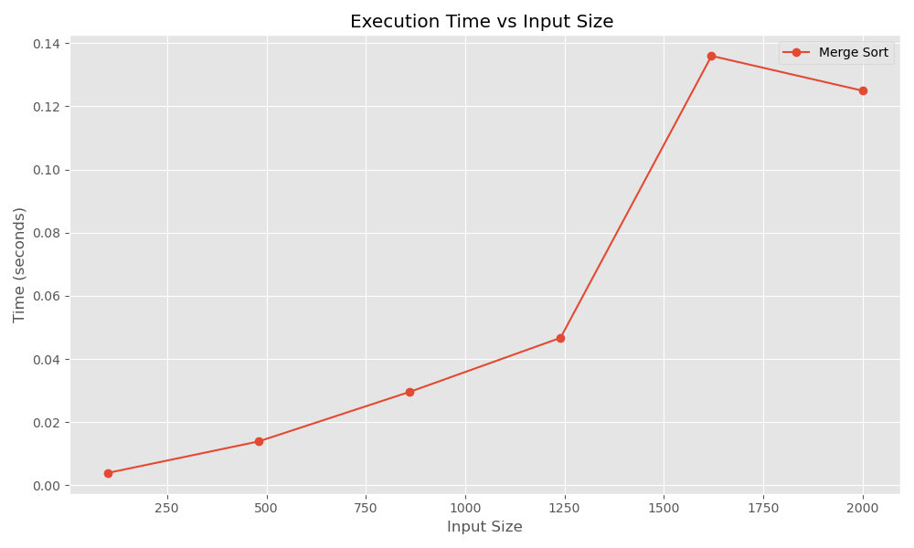
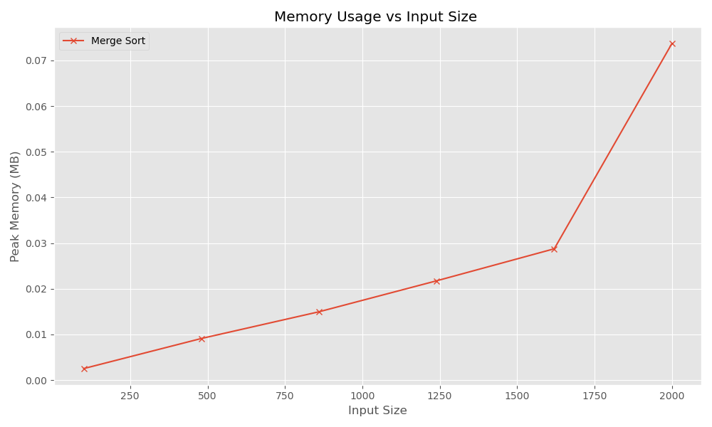
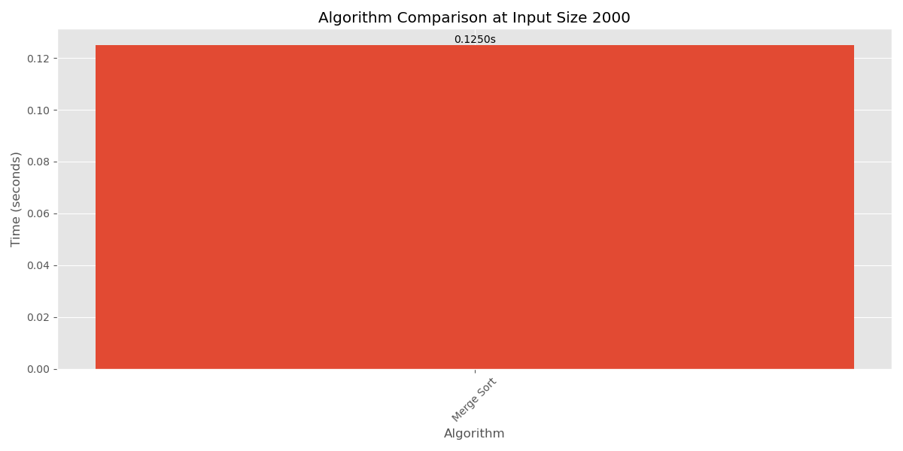

# Algorithm Performance Report
**Date:** 2026-02-23 23:42:22

## 1. Summary Statistics
| Algorithm   |   Input Size | Distribution   |   Trials |   Mean Time (s) |   Median Time (s) |   Std Dev Time |   Mean Memory (B) |   Peak Memory (B) | Complexity   |
|:------------|-------------:|:---------------|---------:|----------------:|------------------:|---------------:|------------------:|------------------:|:-------------|
| Merge Sort  |          100 | random         |        1 |       0.0039226 |         0.0039226 |              0 |              2640 |              2640 | O(n log n)   |
| Merge Sort  |          480 | random         |        1 |       0.0139077 |         0.0139077 |              0 |              9544 |              9544 | O(n log n)   |
| Merge Sort  |          860 | random         |        1 |       0.0295873 |         0.0295873 |              0 |             15680 |             15680 | O(n log n)   |
| Merge Sort  |         1240 | random         |        1 |       0.0467115 |         0.0467115 |              0 |             22792 |             22792 | O(n log n)   |
| Merge Sort  |         1620 | random         |        1 |       0.135992  |         0.135992  |              0 |             30144 |             30144 | O(n log n)   |
| Merge Sort  |         2000 | random         |        1 |       0.124969  |         0.124969  |              0 |             77268 |             77268 | O(n log n)   |

## 3. Visualizations
### Time Complexity Analysis

### Memory Usage Analysis

### Comparative Performance (Max Input)

## 4. Observations
- The fastest algorithm overall was **Merge Sort**.
- The algorithm with highest peak memory was **Merge Sort** (77268 bytes).

---
*Generated by Algorithm Performance Analyzer*